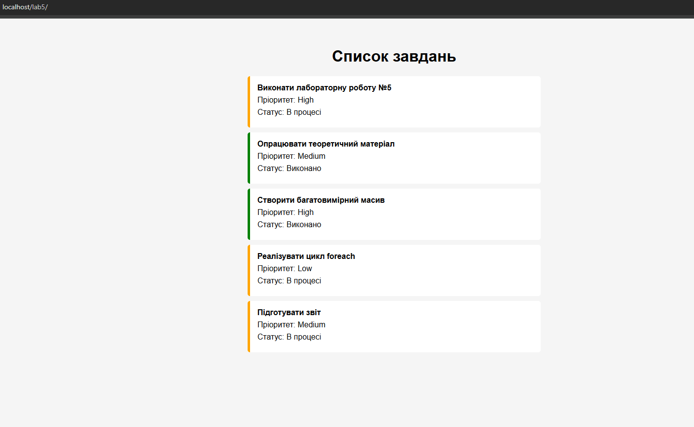

Лабораторна робота №5
Тема

Зберігання та виведення статусу. Масиви та цикл foreach у PHP.

Мета

Навчитися працювати з асоціативними та багатовимірними масивами PHP і виводити їх дані в HTML за допомогою циклу foreach.

1. Масив $tasks
$tasks = [
    [
        'id' => 1,
        'title' => 'Виконати лабораторну роботу №5',
        'priority' => 'High',
        'is_completed' => false
    ],
    [
        'id' => 2,
        'title' => 'Опрацювати теоретичний матеріал',
        'priority' => 'Medium',
        'is_completed' => true
    ],
    [
        'id' => 3,
        'title' => 'Створити багатовимірний масив',
        'priority' => 'High',
        'is_completed' => true
    ],
    [
        'id' => 4,
        'title' => 'Реалізувати цикл foreach',
        'priority' => 'Low',
        'is_completed' => false
    ],
    [
        'id' => 5,
        'title' => 'Підготувати звіт',
        'priority' => 'Medium',
        'is_completed' => false
    ]
];

2. Цикл foreach
<ul class="task-list">

    <?php foreach ($tasks as $task): ?>

        <li class="<?= $task['is_completed'] ? 'task-done' : 'task-pending' ?>">

            <strong><?= formatTitle($task['title']) ?></strong>

            
Пріоритет: <?= $task['priority'] ?>

            

                Статус:
                <?= $task['is_completed'] ? 'Виконано' : 'В процесі' ?>
            

        </li>

    <?php endforeach; ?>

</ul>

3. Скриншот результату

4. Контрольні запитання
1. Різниця між індексованим та асоціативним масивом

Індексований масив використовує числові індекси:

$colors = ['red', 'green', 'blue'];

echo $colors[0];

Асоціативний масив використовує іменовані ключі:

$user = [
    'name' => 'Ivan',
    'age' => 20
];

echo $user['name'];

2. Цикл foreach

foreach перебирає всі елементи масиву без необхідності вручну працювати з індексами.

foreach ($tasks as $task) {
    echo $task['title'];
}

Для роботи з масивами він простіший за for.

3. Неіснуючий ключ

Якщо звернутися до ключа, якого немає:

echo $task['deadline'];

PHP видасть попередження Undefined array key.

Безпечний варіант:

echo $task['deadline'] ?? 'Дедлайн не встановлено';

4. endforeach

endforeach використовується для зручного поєднання PHP та HTML.

<?php foreach ($tasks as $task): ?>

    <li><?= $task['title'] ?></li>

<?php endforeach; ?>

Такий запис робить HTML-код більш зрозумілим.

5. Функції для роботи з масивами

count() — повертає кількість елементів.

sort() — сортує масив.

in_array() — перевіряє наявність значення.

array_filter() — фільтрує елементи масиву.

Висновок

Під час лабораторної роботи було створено багатовимірний масив завдань та реалізовано його виведення за допомогою циклу foreach. Також було використано асоціативні масиви, умовне визначення статусу та CSS-класи для оформлення завдань.